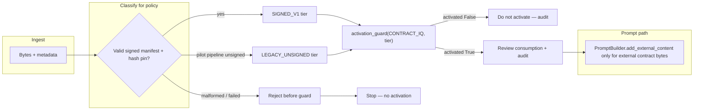

# FS-1 — Engineering execution plan (ForgeShield)

> **Status:** planning. **Normative for ForgeShield repo work** aligned with
> `docs/product/FS-1_CONTRACTFORGE_PILOT_PLAN.md`. This document does not
> change code by itself.
>
> **Baseline commits:** `e6ea117` (FS-0.5 scratch gate), `bbb55a3` (FS-1
> ContractForge pilot plan).

## 1. FS-1 engineering mission

Deliver the **ForgeShield-side** execution path for FS-1: prove that the
existing FS-0.5 stack (**activation guard**, **CC-14 review artifact policy**,
**PromptBuilder D7**, **wrap_untrusted_content D6**) is sufficient for the
ContractForge pilot integration described in the product plan—through **tests,
CI discipline, and documentation**—without widening `LEGACY_UNSIGNED` beyond the
ContractForge pilot allowance, without weakening DocketForge or GrantForge
**SIGNED_V1-only** rules, and **without implementing or modifying ContractForge**
in this repository.

Engineering success means:

- ForgeShield APIs and policy tables match the pilot’s intent and remain pinned
  by automated tests.
- `activation_guard` is validated as the sole “may I activate?” gate for product
  semantics that this repo can exercise.
- Prompt hygiene (D6/D7) remains enforced by tests and semgrep tripwires.
- FS-1 work **does not** depend on NativeForge’s temporary `LEGACY_UNSIGNED`
  acceptance for ContractForge scenarios (NativeForge tightening stays FS-12).

Non-goals for ForgeShield FS-1 engineering (see pilot §11): signing producers,
DocketForge/GrantForge product integration, NativeForge FS-12 policy edits,
new `ReviewArtifactTier` values.

---

## 2. Existing FS-0.5 primitives available for reuse

| Primitive | Location | Role |
|-----------|----------|------|
| **CC-14 policy table** | `src/forge_security/artifact_integrity/review_artifacts.py` | `POLICIES`, `is_tier_accepted`, `enforce_tier`; exactly two tiers (`LEGACY_UNSIGNED`, `SIGNED_V1`); DocketForge defensive denial of `LEGACY_UNSIGNED` regardless of table drift. |
| **Activation guard** | `src/forge_security/lifecycle/activation_guard.py` | `activation_guard(product, tier)` → `ActivationDecision`; never raises; delegates acceptance to `enforce_tier`. |
| **D7 PromptBuilder** | `src/forge_security/ai_security/prompt_builder.py` | Five-layer `build()` → `list[dict]`; **only** `add_external_content` may ingest external bytes; routes through `wrap_untrusted_content`. |
| **D6 untrusted envelope** | `src/forge_security/ai_security/untrusted_content.py` | `wrap_untrusted_content(content, source)` — Unicode stripping, neutralization, truncation, safe `source` attribute. |
| **Semgrep tripwire** | `semgrep/forge_security/no-direct-prompt-fstring.yml` | Blocks risky f-string construction into prompt/message variables (documented run line in file header). |
| **Pytest layout** | `tests/conftest.py`, `tests/security/*.py` | `PYTHONPATH=src` injection for collection; security tests grouped under `tests/security/`. |

Package surface is intentionally small (`src/forge_security/` — eight Python
modules under the three subpackages above plus package `__init__` files).

---

## 3. Proposed FS-1 module/file changes (ForgeShield repo)

Changes are **incremental and test-first**; avoid touching policy unless a bug
is discovered. Expected touch areas:

| Area | Likely files | Notes |
|------|--------------|--------|
| **Guard / policy matrix tests** | `tests/security/test_review_artifacts_policy.py` | Extend `activation_guard` coverage for full product × tier matrix where still missing; keep NativeForge tests clearly labeled as FS-12 precursors, not ContractForge dependencies. |
| **Prompt / untrusted path tests** | `tests/security/test_prompt_builder.py`, `tests/security/test_untrusted_content.py` | Add or tighten fixtures that model “contract bytes appear only inside one external envelope” for review prompts. |
| **Lifecycle API** | `src/forge_security/lifecycle/activation_guard.py` | **Optional** later ticket: extend `ActivationDecision` or add a thin helper for structured audit fields **only if** product-neutral logging contract is agreed; must not change tier enforcement semantics. |
| **Documentation** | `docs/architecture/`, `docs/product/` | Execution plan, runbooks, CI references—no ContractForge code. |
| **CI / tooling** | `pyproject.toml`, optional future scripts | Only if adding non-invasive checks (e.g. policy snapshot); no weakening of dev dependencies. |

**Explicitly out of scope here:** ContractForge application code, repositories,
or deployment configs.

---

## 4. Proposed test files and exact behaviors to test

**Existing files (extend in place unless a split improves clarity):**

- `tests/security/test_review_artifacts_policy.py`
- `tests/security/test_prompt_builder.py`
- `tests/security/test_untrusted_content.py`

**Behaviors to pin (aligned with pilot §7 and current tests):**

| Behavior | Assertion sketch |
|----------|------------------|
| **Tier constants** | `ReviewArtifactTier` string values match `"LEGACY_UNSIGNED"` / `"SIGNED_V1"`. |
| **Contract IQ pilot** | `is_tier_accepted(CONTRACT_IQ, LEGACY_UNSIGNED)` and `(..., SIGNED_V1)` True. |
| **DocketForge** | `LEGACY_UNSIGNED` rejected via `is_tier_accepted`, `enforce_tier` raises, `POLICIES` row contains only `SIGNED_V1`, defensive path in `is_tier_accepted` blocks legacy even if table were corrupted. |
| **GrantForge** | `SIGNED_V1` allowed; `LEGACY_UNSIGNED` denied. |
| **NativeForge (today)** | Existing test remains a **FS-12 precursor** only; FS-1 ContractForge-focused tests must not *require* NativeForge behavior. |
| **activation_guard — Contract IQ** | `LEGACY_UNSIGNED` → `activated=True`; `SIGNED_V1` → `activated=True` (explicit test addition recommended). |
| **activation_guard — DocketForge** | `LEGACY_UNSIGNED` → `activated=False`, reason mentions tier/product denial; `SIGNED_V1` → `activated=True`. |
| **activation_guard — GrantForge** | `LEGACY_UNSIGNED` → `activated=False`; `SIGNED_V1` → `activated=True` (explicit `activation_guard` tests recommended). |
| **Guard never raises** | All `(product, tier)` pairs return `ActivationDecision` with non-empty `reason` when rejected. |
| **PromptBuilder ordering** | Five layers in fixed order when populated; external layer contains `EXTERNAL_UNTRUSTED_CONTENT`. |
| **CC-10 message shape** | `list` indexing; each message has `role` and `content`. |
| **Single external choke point** | Only `add_external_content` takes `(content, source)`; wraps via envelope. |
| **Trusted layer rejection** | Role-switch markers raise `PromptInjectionError` in system/developer/trusted layers. |
| **External neutralization** | Hostile patterns become `[NEUTRALIZED:…]`; no raw injection phrases in built content for representative payloads. |
| **wrap_untrusted_content** | Envelope shape, Unicode stripping, truncation, source escaping, type validation. |

**Optional hardening (pilot §8):** golden hash or serialized snapshot of
`POLICIES` to catch accidental table edits—new test module only if approved
(e.g. `tests/security/test_policies_snapshot.py`).

---

## 5. CI/check commands

Local and CI should run the same checks (exact tooling versions per org
standard).

**Python tests**

```bash
cd /path/to/forgeshield
python -m venv .venv && . .venv/bin/activate
pip install -e ".[dev]"
export PYTHONPATH=src
python -m pytest -v
```

(`tests/conftest.py` adds `src/` to `sys.path`; `PYTHONPATH=src` matches the
documented manual invocation.)

**Semgrep (D7 / prompt f-string tripwire)**

```bash
semgrep --config semgrep/forge_security/no-direct-prompt-fstring.yml src
```

**Policy / governance**

- Ensure `.cursor/rules/forgeshield-artifact-policy.mdc` remains present and
  reviewed on PRs touching policy or guard code (optional CI: file existence).

**Regression baseline**

- Full `pytest` suite green on every FS-1 PR.
- Pilot plan referenced “~41 tests” at FS-0.5; **record the kickoff test count**
  when FS-1 execution starts and do not drop count without cause (new skips or
  deleted tests require justification in PR).

---

## 6. ContractForge integration boundary

ForgeShield supplies **libraries and contracts only**. ContractForge (separate
repo / train) owns:

- Classification of inbound bytes into `ReviewArtifactTier` **before** calling
  `activation_guard`.
- Rejection of malformed inputs **before** the guard (no third tier).
- Calls to `activation_guard(Product.CONTRACT_IQ, tier)` as the **only**
  activation policy gate for “may I activate?” — not direct `POLICIES` /
  `is_tier_accepted` / `enforce_tier` for that decision path.
- Routing all externally sourced contract text through
  `PromptBuilder.add_external_content` (and thus D6).
- Audit emission at the integrator: product, tier, decision, timestamp,
  correlation id, and source metadata **the integrator** attaches around the
  returned `ActivationDecision`.

ForgeShield does **not** ship ContractForge services, UI, or storage in FS-1.

---

## 7. Data/artifact flow



**Invariants:** Tier for a given artifact **instance** is fixed after
classification. Re-signing produces a **new** artifact identity (pilot §6).

---

## 8. ActivationDecision contract

Defined in code as a **frozen dataclass** (`activation_guard.py`):

| Field | Type | Meaning |
|-------|------|---------|
| `product` | `Product` | Product enum value passed to the guard. |
| `tier` | `ReviewArtifactTier` | Tier passed to the guard (one of two CC-14 values). |
| `activated` | `bool` | True iff `enforce_tier` would succeed for `(product, tier)`. |
| `reason` | `str` | Human-readable explanation; on success includes acceptance wording; on failure includes exception message from `ArtifactPolicyViolation`. |

**API contract:** `activation_guard` **never raises**; callers must handle
`activated=False` without treating `reason` as end-user copy.

**Future extension (optional ticket):** add optional structured fields (e.g.
correlation id injection only via caller-supplied wrapper) **without** changing
the truth of `activated` / `reason` derivation from `enforce_tier`.

---

## 9. Logging/audit requirements

**ForgeShield library:** audit logging is not mandatory inside
`activation_guard` today; FS-1 **requires integrators** to record each activation
attempt with at least:

- `product` (enum value / wire string)
- `tier` (`LEGACY_UNSIGNED` or `SIGNED_V1` only on allowed paths)
- `activated` and `reason` from `ActivationDecision`
- Timestamp (integrator clock)
- Correlation id (trace/request id)
- Source metadata sufficient to explain what the guard evaluated (integrator
  — not a third tier)

**Forbidden:** logging fabricated tiers; treating “rejected at ingest” as a tier.

Optional ForgeShield-side additions (separate ticket): documented helper or
example structured log line format for consistency across products—still no
ContractForge code in this repo.

---

## 10. Prompt safety requirements

- **Single choke point:** External contract bytes only via
  `add_external_content` → `wrap_untrusted_content`.
- **No trusted-layer smuggling:** No contract bytes in system/developer/trusted
  layers; role-switch markers in trusted layers must raise.
- **Semgrep clean:** No new violations under
  `semgrep/forge_security/no-direct-prompt-fstring.yml` for `src/`.
- **Message list contract:** `PromptBuilder.build()` returns `list[dict]` with
  integer indexing and `role` / `content` keys (CC-10).
- **Neutralization visible:** D6 patterns produce visible `[NEUTRALIZED:…]`
  tokens where applicable.

---

## 11. Policy invariants that must not change (FS-1)

- Exactly **two** `ReviewArtifactTier` values; no third tier or implicit tier.
- `POLICIES[Product.CONTRACT_IQ].accepted_tiers == frozenset({LEGACY_UNSIGNED,
  SIGNED_V1})` — no widening beyond pilot allowance.
- `POLICIES[Product.DOCKETFORGE]` and `POLICIES[Product.GRANTFORGE]` —
  **SIGNED_V1 only**; no `LEGACY_UNSIGNED`.
- Defensive `is_tier_accepted(DOCKETFORGE, LEGACY_UNSIGNED) == False` must
  remain.
- Do **not** add `LEGACY_UNSIGNED` to any product that does not already have it
  under FS-0.5 rules without a deliberate FS-XX plan and synchronized test
  updates (`tests/security/test_review_artifacts_policy.py`).
- `activation_guard` remains the **only** supported “may I activate?” API—do
  not bypass with parallel policy reads in **product** code (enforce by review;
  ForgeShield tests stay focused on library behavior).
- Semgrep and `.cursor/rules/forgeshield-artifact-policy.mdc` must not be
  weakened.

---

## 12. Implementation sequence by small tickets

Tickets are ordered for **low blast radius**: tests and docs first, optional
library ergonomics last.

| ID | Title |
|----|--------|
| FS-1.1 | Complete `activation_guard` product × tier matrix tests |
| FS-1.2 | GrantForge and Contract IQ `SIGNED_V1` guard paths |
| FS-1.3 | Rejected-decision reason quality assertions |
| FS-1.4 | Contract-review PromptBuilder fixture (single external envelope) |
| FS-1.5 | Document CI commands in-repo reference |
| FS-1.6 | Optional `POLICIES` snapshot / hash stability test |
| FS-1.7 | Optional `ActivationDecision` audit ergonomics (non-breaking) |
| FS-1.8 | FS-1 definition-of-done checklist and traceability to pilot §7–§9 |

*(Adjust numbering if some tickets split further during execution.)*

---

## 13. Human review gates

- **Two-person or security-aware review** for any change to:
  `review_artifacts.py`, `activation_guard.py`, semgrep rules under
  `semgrep/forge_security/`, or `tests/security/test_review_artifacts_policy.py`.
- **Explicit reviewer check** for DocketForge / GrantForge rows in `POLICIES`
  and for defensive DocketForge logic in `is_tier_accepted`.
- **No silent semgrep suppressions** — new findings must be fixed or ruled out
  with written rationale in PR (not bulk ignore files for FS-1).
- **ContractForge integrators** (outside this repo): confirm single guard
  callsite and no `POLICIES` import for activation (review checklist).

---

## 14. Rollback plan

Align with pilot §9 **stop-ship / revert** triggers:

| Trigger | Action |
|---------|--------|
| Wrong product receives `LEGACY_UNSIGNED` activation | Immediate revert of offending train; investigate logs and tests. |
| Policy regression (unsigned widened; DocketForge defensive check removed) | Revert policy change; restore tests in same revert. |
| Guard bypass in integrated product | Revert integrator change; ForgeShield unchanged unless library bug. |
| Broken audit (missing tier/product/correlation) | Revert integrator logging layer; FS-0.5 primitives stay. |
| Semgrep / D6/D7 hygiene failure | Revert violating commits; do **not** relax rules. |
| Stability SLO breach (operator-defined) | Scale down pilot or revert integration per operator playbook. |

Rollback **does not** relax DocketForge or GrantForge policy; it restores known-good integration while keeping FS-0.5 tables and primitives intact unless security dictates otherwise.

---

## 15. Definition of done

FS-1 ForgeShield engineering is **done** when:

1. **Tests:** All behaviors in §4 are explicitly covered (including recommended
   gaps such as `activation_guard(CONTRACT_IQ, SIGNED_V1)` and GrantForge
   `activation_guard` pairs).
2. **CI:** `pytest` full suite passes; semgrep command in §5 clean on `src/`.
3. **Policy:** §11 invariants hold; `test_review_artifacts_policy.py` pins the
   table and defensive checks.
4. **No ContractForge code** in this repo for FS-1 delivery (boundary §6).
5. **Traceability:** This execution plan and the pilot plan remain aligned;
   optional integrator checklist references `ActivationDecision` and D6/D7.
6. **NativeForge:** FS-1 deliverables do not require NativeForge pilot paths for
   ContractForge validation.

ContractForge “pilot live” acceptance is **outside** this repo but depends on
the above library guarantees.

---

## Ticket specifications

### FS-1.1 — Complete `activation_guard` matrix tests

- **Goal:** Ensure every product’s allow/deny behavior for `activation_guard`
  is explicitly tested (not only `is_tier_accepted`), excluding unnecessary
  duplication.
- **Files likely touched:** `tests/security/test_review_artifacts_policy.py`
- **Tests required:** New `activation_guard` cases covering missing pairs;
  existing tests must remain green.
- **Acceptance criteria:** Full matrix documented in test names/comments;
  `activation_guard` coverage matches §4 for DOCKETFORGE, CONTRACT_IQ,
  GRANTFORGE; NativeForge coverage stays clearly labeled as FS-12 precursor.
- **Forbidden changes:** Editing `POLICIES`; editing DocketForge defensive
  branch; removing NativeForge test without FS-12 replacement plan.

### FS-1.2 — Contract IQ `SIGNED_V1` and GrantForge deny legacy via guard

- **Goal:** Explicit tests: `activation_guard(CONTRACT_IQ, SIGNED_V1)` allows;
  `activation_guard(GRANTFORGE, LEGACY_UNSIGNED)` denies;
  `activation_guard(GRANTFORGE, SIGNED_V1)` allows.
- **Files likely touched:** `tests/security/test_review_artifacts_policy.py`
- **Tests required:** Three dedicated tests (or parametrized equivalent).
- **Acceptance criteria:** Assertions on `activated` and meaningful `reason`
  when denied.
- **Forbidden changes:** Any production code change solely for test convenience;
  widening `LEGACY_UNSIGNED`.

### FS-1.3 — Rejected-decision reason assertions

- **Goal:** Strengthen assertions that denied decisions have non-empty,
  informative `reason` strings (all denied `(product, tier)` pairs in scope).
- **Files likely touched:** `tests/security/test_review_artifacts_policy.py`
- **Tests required:** Extend `test_activation_guard_never_raises` pattern or
  add parametrized deny cases.
- **Acceptance criteria:** Every denied case asserts `reason` non-empty and
  stable substring (tier/product reference).
- **Forbidden changes:** Changing `ActivationDecision.reason` format in
  production code without migration note (prefer assertions flexible to wording).

### FS-1.4 — Contract-review PromptBuilder fixture

- **Goal:** One representative test proving external contract body appears
  exactly inside the `EXTERNAL_UNTRUSTED_CONTENT` envelope and not in
  system/developer/trusted layers (align pilot prompt hygiene).
- **Files likely touched:** `tests/security/test_prompt_builder.py`
- **Tests required:** New test building a realistic multi-layer prompt with
  placeholder contract text in `add_external_content` only.
- **Acceptance criteria:** Single user-role envelope block contains contract
  marker; trusted layers contain only internal placeholders.
- **Forbidden changes:** Relaxing semgrep rules; adding non-external paths for
  external bytes.

### FS-1.5 — CI/check command reference

- **Goal:** Single authoritative pointer for pytest + semgrep commands (§5),
  linked from architecture docs or minimal developer-facing doc **if** missing.
- **Files likely touched:** `README.md` or `docs/architecture/` companion only
  if the repo lacks run instructions (minimal addition).
- **Tests required:** None (documentation).
- **Acceptance criteria:** Commands copy-paste match `pyproject.toml` /
  `conftest.py` / semgrep header.
- **Forbidden changes:** Large doc rewrites; ContractForge documentation.

### FS-1.6 — Optional `POLICIES` snapshot

- **Goal:** Golden hash or canonical serialization of `POLICIES` to detect
  accidental edits (pilot §8 optional).
- **Files likely touched:** `tests/security/test_review_artifacts_policy.py` or
  new `tests/security/test_policies_snapshot.py`
- **Tests required:** One snapshot test; update procedure documented in test
  comment.
- **Acceptance criteria:** Intentional policy changes require deliberate
  snapshot update in same PR.
- **Forbidden changes:** Snapshotting unrelated modules; loosening policy tests.

### FS-1.7 — Optional audit ergonomics on `ActivationDecision`

- **Goal:** If integrators need consistent structured logging, add a **backward
  compatible** helper or optional fields on `ActivationDecision` (e.g.
  `timestamp` **not** auto-added inside guard unless explicitly requested—prefer
  integrator-owned timestamps).
- **Files likely touched:** `src/forge_security/lifecycle/activation_guard.py`,
  possibly `tests/security/test_review_artifacts_policy.py`
- **Tests required:** Unit tests for any new public API; existing guard tests
  unchanged in behavior.
- **Acceptance criteria:** `activation_guard` still never raises; `activated`
  remains purely policy-derived.
- **Forbidden changes:** Importing logging side effects by default; changing
  `enforce_tier` semantics; adding tiers.

### FS-1.8 — Definition-of-done checklist

- **Goal:** Close-out checklist mapping pilot §7–§10 to repo artifacts (this
  document + test inventory).
- **Files likely touched:** `docs/architecture/FS-1_ENGINEERING_EXECUTION_PLAN.md`
  (revision only) or a short `docs/product/` checklist if the team prefers.
- **Tests required:** N/A
- **Acceptance criteria:** Reviewer can verify FS-1 completion without reading
  the full pilot plan.
- **Forbidden changes:** ContractForge repo references as implementation
  dependencies inside ForgeShield code.

---

**References:** `docs/product/FS-1_CONTRACTFORGE_PILOT_PLAN.md`,
`src/forge_security/artifact_integrity/review_artifacts.py`,
`src/forge_security/lifecycle/activation_guard.py`,
`src/forge_security/ai_security/prompt_builder.py`,
`src/forge_security/ai_security/untrusted_content.py`,
`tests/security/test_review_artifacts_policy.py`,
`tests/security/test_prompt_builder.py`,
`tests/security/test_untrusted_content.py`,
`semgrep/forge_security/no-direct-prompt-fstring.yml`,
`.cursor/rules/forgeshield-artifact-policy.mdc`.
